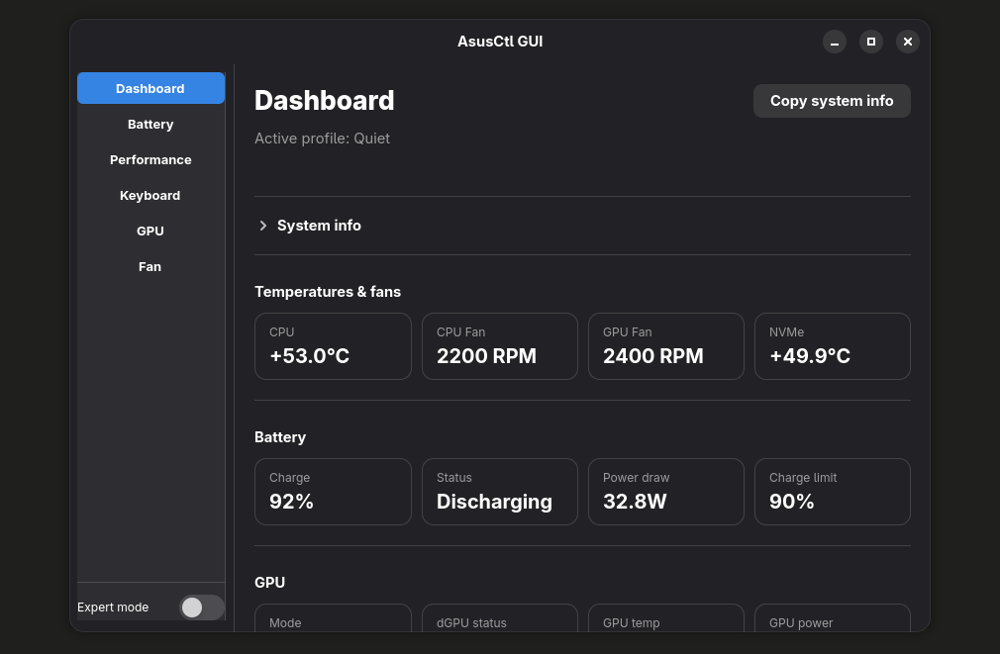

# AsusCtl GUI

A simple GTK4 graphical interface for controlling ASUS laptop settings on Linux (Fedora/GNOME), built on top of `asusctl` and `supergfxctl`.



## Why this app?

`asusctl` and `supergfxctl` are powerful tools but require terminal commands. This app provides a clean, user-friendly interface to control the most useful settings without needing to open a terminal.

## Features

- **Dashboard** — real-time system info (temperatures, fans, battery, GPU status) with a one-click copy button for support/debugging
- **Battery** — charge limit slider, one-time full charge with cancel option
- **Performance** — Quiet / Balanced / Performance profile selector
- **Keyboard** — backlight brightness control
- **GPU** — switch between Integrated / Hybrid / AsusMuxDgpu modes with smart logout prompts
- **Fan** — reset fan curves to ASUS defaults per profile
- **Expert mode** — toggle to reveal advanced options in each tab (fan curves, BIOS charge mode, panel overdrive, dGPU disable)

## Requirements

- Fedora Linux with GNOME
- [`asusctl`](https://gitlab.com/asus-linux/asusctl) installed
- [`supergfxctl`](https://gitlab.com/asus-linux/supergfxctl) installed
- Python 3 with GTK4 bindings (`python3-gi`)

## Install

```bash
git clone https://github.com/edouardproust/asusctl-gui.git
cd asusctl-gui
chmod +x install.sh
./install.sh
```

The app will appear in the GNOME application menu as **AsusCtl GUI**.

## Uninstall

```bash
chmod +x uninstall.sh
./uninstall.sh
```

## Run manually

```bash
python3 /opt/asusctl-gui/main.py
```

## sudoers rule (required)

Some commands (`asusctl`, `supergfxctl`) require elevated privileges. Add this rule to allow passwordless execution:

```bash
sudo nano /etc/sudoers.d/asusctl-gui
```

```
your_username ALL=(ALL) NOPASSWD: /usr/bin/asusctl, /usr/bin/supergfxctl
```

## Tested on

- ASUS TUF Gaming F16 (FX608JMR)
- Fedora 43 — kernel 6.19
- NVIDIA RTX 5060 Mobile (driver 580)
- asusctl 6.3.6 / supergfxctl 5.2.7